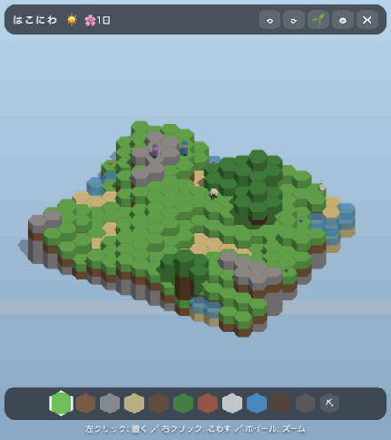

# はこにわ 🌱

デスクトップの端にずっと浮かんでいる、六角ブロックの小さな箱庭ゲーム。
斜め上からの見下ろし視点で、マイクラのようにブロックを積んで世界をつくれます。
ひとや動物は勝手に歩き回り、自動発展モードをオンにすると世界がひとりでに育ちます。

季節と昼夜がめぐり、天気が変わり、環境音が鳴る「眺める系」デスクトップウィジェットです。
透明ウィンドウなので、デスクトップにブロックの影だけが落ちます。

<p align="center">
  
</p>

## 動作環境

- macOS (Apple Silicon)
- Node.js 20+ / npm

Electron 製なので他プラットフォームでも動く可能性はありますが、未検証です
(ウィンドウの透明・常時最前面まわりは macOS でのみ確認しています)。

## 起動

### アプリとして(ふだん使い)

`/Applications/はこにわ.app` を開く(Spotlight で「はこにわ」)。

コードを変えたら作りなおす:

```sh
npm run package
ditto "release/はこにわ-darwin-arm64/はこにわ.app" "/Applications/はこにわ.app"
```

### 開発時

```sh
npm install
npm start
```

開発・運用の詳細は [DEVELOPMENT.md](DEVELOPMENT.md)、コード構造は [AGENTS.md](AGENTS.md) を参照。

画面右下に透明な小窓が常時最前面で開きます。上部のバーをドラッグすると移動、
ウィンドウの端をドラッグするとサイズ変更できます。

## 遊びかた

| 操作 | 動作 |
| --- | --- |
| 左クリック | 選択中のブロックをそのマスの上に積む |
| 右クリック(または ⛏ ツール) | そのマスの一番上のブロックをこわす |
| マウスホイール | ズーム |
| ⟲ / ⟳ | 視点を60度ずつ回転 |
| 🌱 | 自動発展モードの切り替え |
| ⚙ | 設定(マス数・高さ上限・なかま追加・つくりなおし) |
| ✕ | 終了 |

### 自動発展モード

🌱 をオンにすると、時間とともに世界が育ちます。

- 草が土へひろがる
- 花が咲く
- 木が少しずつ育つ
- 山のてっぺんに雪が積もる
- ひと(🧑)がいるとレンガの小屋を建てはじめる
- 雨の日は草花がよく育ち、雪の日は雪が積もり、晴れると雪はとける

### 天気と昼夜

天気(☀️☁️🌧️🌨️)は時間とともにランダムにうつりかわり、トップバーに表示されます。
雨や雪は画面に降り、雲が流れ、明るさも変わります。
昼夜サイクル(1日の長さは設定で変更可)で朝焼け・夕暮れ・夜があり、
晴れた夜にはほたるが舞います。

### 季節

3日ごとに はる🌸→なつ🌻→あき🍁→ふゆ⛄ がめぐります(トップバーに季節と日数を表示)。

- 葉と草の色が季節で変わり、秋は落ち葉が舞う
- 天気の出やすさが変わる(夏は晴れがち、冬は雪がち)
- 春は花がよく咲き、冬は木が育たない
- 冬は池が凍って、キャラクターが氷の上を歩ける

### 夜の生活

夜になると、ひとは家やたきびのそばへ歩いていって眠り、動物はその場で眠ります。
家には夜だけあかりがともり、朝になるとみんな起きて散らばります。

### 世代

- にわとりはたまに卵を産み、ひよこがかえって、やがておとなになる
- ひつじが2頭以上いると、こひつじがうまれる
- 旅人は、家に空きがあると村にすみつくことがある

### いきものと訪問者

- ひつじは草を食べます(食べたあとは土になる)
- 晴れた昼は蝶が花のまわりを舞い、鳥の群れが空を横切ります
- 池からは魚がぴょんと跳ねます
- ときどき旅人が通りすがり、去っていきます

### 水とたきび

みずブロックは低いほうへ流れ、平地でも数マスひろがります。
たきびブロックを置くと、ゆらめく炎が灯ります。

### セーブ

世界とキャラクターは自動保存され、次回起動時に続きから始まります。
(保存先: Electron の userData ディレクトリの `world.json`)

## ライセンス

[MIT](LICENSE)

## 構成

- `main.js` / `preload.js` — Electron メインプロセス(透明・常時最前面ウィンドウ)
- `src/renderer/world.js` — 六角グリッド(odd-r オフセット座標)のワールドモデル
- `src/renderer/scene3d.js` — Three.js 描画(InstancedMesh・アイソメ風カメラ)
- `src/renderer/characters.js` — 自律的に歩き回るキャラクター
- `src/renderer/autopilot.js` — 自動発展のルール
- `src/renderer/terrain.js` — 初期地形の生成
